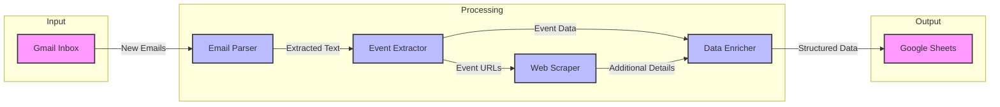

# 🤖 Event Agent

Working on some scripts to build a personal agent for social or professional event tracking and management. This is very much a work in progress, so please check back for updates and feel free to leave comments, feedback, or requests! ✨

## 🛠️ Agent Functionality

### 🎉 Event Tracking & Management
The **Event Agent** is designed to help you track and manage your social and professional events. I created an email account, signed up for mailing lists of meetups and event notifications, and then built this agent to parse the emails into structured data in a Google sheet so I can easily see and filter events from across a bunch of sources, including personal invites that I forward to my event email address.

**🌟 Key Features:**
- **Email Integration:** Automatically pull event data from unstructured emails so nothing gets lost! ⏰
- **Web Scraping:** Visit event websites to fill out additional details that might not be in the email summary.
- **Event Organization:** Easily search and filter events in the structured spreadsheet output. 📅
- **Integration with APIs:** Future updates will include support for various APIs to enhance functionality. 🔗

## 🏗️ Architecture

The Event Agent is built as a pipeline that processes emails, extracts event information, and stores it in a structured format. Here's how the components work together:



### Components

1. **Gmail Inbox**
   - Monitors a dedicated email account for event notifications
   - Uses Gmail API to fetch and process new emails
   - Marks processed emails as read and archives them

2. **Email Parser**
   - Extracts relevant information from email bodies
   - Identifies event details like dates, times, and locations
   - Handles various email formats and structures

3. **Event Extractor**
   - Uses OpenAI's GPT to intelligently parse event information
   - Identifies and structures event details from unstructured text
   - Handles variations in event description formats

4. **Web Scraper**
   - Visits event URLs to gather additional details
   - Extracts information from event websites
   - Fills in missing event details

5. **Data Enricher**
   - Combines information from multiple sources
   - Validates and standardizes event data
   - Ensures consistent formatting

6. **Google Sheets**
   - Stores structured event data
   - Provides easy filtering and searching
   - Serves as the central event database

## 🚀 Quick Start

1. Clone this repository:
```bash
git clone https://github.com/yourusername/event-agent.git
cd event-agent
```

2. Install dependencies:
```bash
pip install -r requirements.txt
```

3. Set up your credentials:
   - Copy `my_secrets_template.py` to `my_secrets.py`
   - Fill in your API keys and credentials in `my_secrets.py`
   - Never commit `my_secrets.py` to version control
   - Keep your credentials secure and private

4. Set up Google OAuth:
   - Go to the [Google Cloud Console](https://console.cloud.google.com)
   - Create a new project or select an existing one
   - Enable the Gmail and Google Sheets APIs
   - Create OAuth 2.0 credentials
   - Download the credentials and save as `credentials.json`
   - Run the OAuth setup script:
     ```bash
     python3 oauth_setup.py
     ```
   - Follow the authentication flow in your browser

## 🔧 Troubleshooting

### 🔑 OAuth Token Issues
If you encounter errors like "Token has been expired or revoked" or other authentication issues, follow these steps to refresh your OAuth token:

1. Delete the existing token file:
```bash
rm -f token.json
```

2. Run the OAuth setup script:
```bash
python3 oauth_setup.py
```

3. Follow the authentication flow:
   - Click the URL that appears in the terminal
   - Sign in with your Google account
   - Grant the requested permissions
   - Wait for the "Authentication successful" message

After completing these steps, your token will be renewed and the script should work again.

## 🔒 Security Best Practices
- Never commit your credentials or API keys to version control
- Keep your `my_secrets.py` file secure and private
- Regularly rotate your API keys and tokens
- Use environment variables for sensitive data in production
- Review the `.gitignore` file to ensure sensitive files are not tracked

## 💡 Stay Tuned for More Updates!
Feel free to open an issue or submit a pull request with feedback or feature suggestions. 🌟
