# 🤖 Event Agent

An intelligent agent that processes event-related emails, extracts event details, and stores them in a hybrid database architecture. Built with Python, Gmail API, OpenAI, AWS DynamoDB, and Qdrant vector database. The application provides a Streamlit interface for viewing and managing events, with the option to export events to Google Sheets.

## Features

- 📧 **Email Processing**: Automatically fetches and processes event-related emails from Gmail
- 🤖 **AI-Powered Extraction**: Uses OpenAI to intelligently extract event details from email content
- 🗄️ **Hybrid Storage**: Stores emails in Qdrant (vector database) and events in DynamoDB
- 🎯 **Event Management**: Tracks and manages events with detailed information
- 🎨 **Streamlit Interface**: Beautiful web interface for monitoring and managing the system
- 📊 **Google Sheets Export**: Export events to Google Sheets for additional analysis
- 🔍 **Vector Search**: Qdrant integration for enhanced email storage and retrieval

## Architecture

```mermaid
graph LR
    subgraph Input [📥 Input]
        G([📥 Gmail Inbox])
    end

    subgraph Processing [⚙️ Processing]
        E([Email<br>Parser])
        X([Event<br>Extractor])
        W([Web<br>Scraper])
        D([Data<br>Enricher])
        DB([🗄️ DynamoDB<br>Events])
        Q([🔍 Qdrant<br>Emails])
    end

    subgraph Output [📤 Output]
        UI([💬 Streamlit UI])
        GS([Google Sheets])
    end

    G -->|New Emails| E
    E -->|Extracted Text| Q
    Q -->|Stored Email Data| X
    X -->|Event Data| D
    X -->|URLs| W
    W -->|Extra Info| D
    D -->|Stores Events| DB
    Q -->|Vector Search| UI
    DB -->|Structured Data| UI
    DB -->|Structured Data| GS
    UI -->|Export Data Command| GS

    style G fill:#5a7de2,stroke:#fff,stroke-width:2px,color:#fff
    style E fill:#5a7de2,stroke:#fff,stroke-width:2px,color:#fff
    style X fill:#5a7de2,stroke:#fff,stroke-width:2px,color:#fff
    style W fill:#5a7de2,stroke:#fff,stroke-width:2px,color:#fff
    style D fill:#5a7de2,stroke:#fff,stroke-width:2px,color:#fff
    style UI fill:#5a7de2,stroke:#fff,stroke-width:2px,color:#fff
    style DB fill:#5a7de2,stroke:#fff,stroke-width:2px,color:#fff
    style GS fill:#5a7de2,stroke:#fff,stroke-width:2px,color:#fff
    style Q fill:#5a7de2,stroke:#fff,stroke-width:2px,color:#fff

    linkStyle default stroke-dasharray: 9,5,stroke-dashoffset: 900,animation: dash 25s linear infinite;
```



## Prerequisites

- Python 3.8+
- AWS Account with DynamoDB access
- Gmail Account
- OpenAI API Key
- Google Cloud project with:
  - Gmail API enabled
  - Google Sheets API enabled
  - OAuth 2.0 credentials configured
- Qdrant instance (required for email storage)

## Setup

1. **Clone the repository**
   ```bash
   git clone https://github.com/yourusername/event-agent.git
   cd event-agent
   ```

2. **Install dependencies**
   ```bash
   pip install -r requirements.txt
   ```

3. **Set up credentials**
   - Copy `my_secrets_template.py` to `my_secrets.py`:
     ```bash
     cp my_secrets_template.py my_secrets.py
     ```
   - Fill in your credentials in `my_secrets.py`:
     ```python
     # Gmail API credentials
     CLIENT_ID = "your_client_id"
     CLIENT_SECRET = "your_client_secret"
     
     # AWS credentials
     event_agent_aws_access_key_id = "your_aws_access_key"
     event_agent_aws_secret_access_key = "your_aws_secret_key"
     event_agent_aws_region = "your_aws_region"
     
     # OpenAI API key
     openai_by = "your_openai_api_key"
     
     # Google Sheets
     SPREADSHEET_ID = "your_google_sheets_id"
     
     # Qdrant Vector Database
     QDRANT_URL = "your_qdrant_url"
     QDRANT_API_KEY = "your_qdrant_api_key"
     ```
   - ⚠️ **Important**: Never commit `my_secrets.py` to version control. It's already in `.gitignore`.

4. **Set up Gmail API**
   - Enable Gmail API in Google Cloud Console
   - Download credentials.json
   - Run OAuth setup:
     ```bash
     python3 setup.py
     ```

5. **Set up DynamoDB and Qdrant**
   - Run the setup script:
     ```bash
     python3 setup.py
     ```
   - This creates:
     - DynamoDB `events` table: Stores extracted event information
     - Qdrant `emails` collection: Stores email data with vector embeddings

## Usage

1. **Run the Streamlit app**
   ```bash
   streamlit run main.py
   ```

2. **Using the Interface**
   - Check system status (Gmail, AWS, DynamoDB, Qdrant)
   - Setup DynamoDB tables if needed
   - Process new emails
   - View event emails and extracted events
   - Filter and sort events
   - Export events to Google Sheets

## Data Storage

### Qdrant Email Storage
- **Collection**: `emails`
- **Vector Size**: 1536 (OpenAI embedding size)
- **Distance Metric**: Cosine
- **Data Types**:
  - `full_email`: Complete email with embedding
  - `email_chunk`: Email body chunks for better analysis
- **Fields**:
  - `msg_id`: Unique message ID
  - `received`: Timestamp when email was received
  - `from_email`: Email sender
  - `subject`: Email subject
  - `body`: Email body content
  - `processed`: Timestamp when email was processed
  - `type`: Data type (full_email or email_chunk)

### DynamoDB Events Table
- `event_id`: Unique event ID (Primary Key)
- `event_name`: Name of the event
- `date`: Event date (timestamp)
- `start_time`: Event start time
- `end_time`: Event end time
- `city`: Event city
- `state`: Event state
- `venue`: Event venue
- `address`: Event address
- `description`: Event description
- `url`: Event URL

## Troubleshooting

### Gmail API Issues
1. **Token Expired/Revoked**
   - Delete `token.json`
   - Run `python3 setup.py`
   - Re-authenticate with Gmail

2. **Insufficient Permissions**
   - Ensure you have granted all required scopes:
     - `https://www.googleapis.com/auth/gmail.readonly`
     - `https://www.googleapis.com/auth/gmail.modify`

### DynamoDB Issues
1. **Tables Not Found**
   - Run `python3 setup.py`
   - Verify AWS credentials in `my_secrets.py`

2. **Access Denied**
   - Check AWS IAM permissions
   - Verify region matches your DynamoDB tables

### Qdrant Issues
1. **Collection Not Found**
   - The application automatically creates the `emails` collection
   - Check Qdrant connection and credentials
   - Verify `QDRANT_URL` and `QDRANT_API_KEY` in `my_secrets.py`

2. **Connection Failed**
   - Verify Qdrant instance is running
   - Check network connectivity
   - Validate API key permissions

## Security

- Never commit `my_secrets.py` or `token.json`
- Use `.gitignore` to exclude sensitive files
- Rotate AWS and Gmail credentials regularly
- Keep dependencies updated

## Contributing

1. Fork the repository
2. Create a feature branch
3. Commit your changes
4. Push to the branch
5. Create a Pull Request

## Google Sheets Integration

The application can export events to Google Sheets for additional analysis. To use this feature:

1. Ensure you have a Google Cloud project with the Sheets API enabled
2. Configure the `SPREADSHEET_ID` in `my_secrets.py`
3. The first time you use the export feature, you'll need to authorize the application
4. Click the "Export to Google Sheets" button to export current events

The exported data will include all event fields:
- Event Name
- Date
- Start Time
- End Time
- City
- State
- Venue
- Address
- Description
- URL
